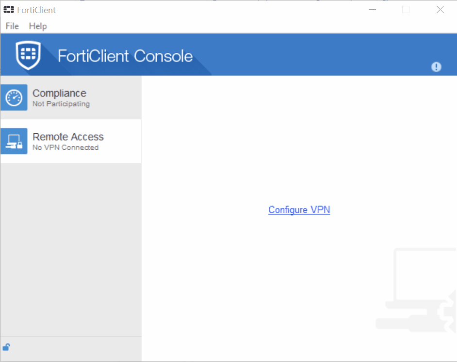
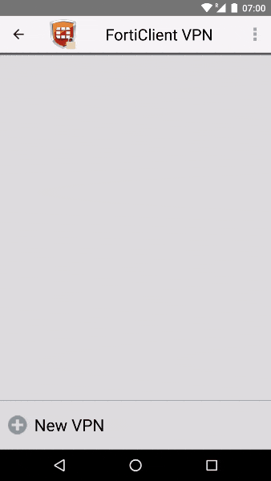
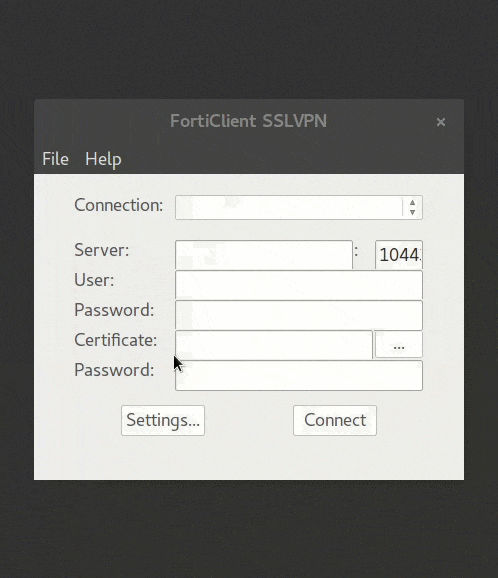
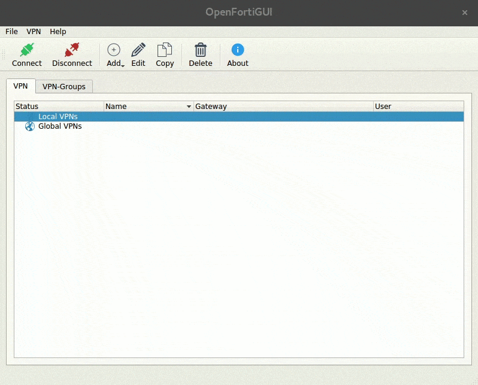

# IITM VPN Documentation
IIT Madras provides VPN access to its netowrk via Fortigate SSL VPN. 
In order to enable VPN, student/faculty/staff should make a request to Computer Center.
VPN can be accessed through FortiClient by using LDAP username and password.

## Installation

### Windows, MacOS, iOS & Android

- Download and install `Forticlient` from 
  [FortiNet Website](https://www.fortinet.com/support-and-training/support/product-downloads.html)
- `FortiClient` is also available for download at [IITM Website](https://vpn.iitm.ac.in:10443) (Login using LDAP)
- Direct download links:
  - [Windows (7 or higher)](http://forticlient.com/downloads/FortiClientOnlineInstaller.exe)
  - [Windows 10 and Windows Phone 10](https://www.microsoft.com/en-ca/store/p/forticlient/9wzdncrdh6mc)
  - [MacOS (v10.8 Mountain Lion or higher)](http://forticlient.com/downloads/FortiClient_Installer.dmg)
  - [iOS (9.0.0 or higher)](http://itunes.apple.com/md/app/forticlient/id525600370?mt=8)
  - [Android (4.1 Jelly Bean or higher)](https://play.google.com/store/apps/details?id=com.fortinet.forticlient)

### Ubuntu & Debian

- FortiClient
  - Download and extract `FortiClient for Linux` from [here](forticlientsslvpn_linux_4.4.2329.tar.gz)
  
 OR
 
- OpenFortiGUI
  - Download and install `OpenFortiGUI` from
    [Bits and Bytes](https://hadler.me/linux/openfortigui/)
  - Direct download links:
    - [Ubuntu 16.04 64 bit](https://hadler.me/files/openfortigui/openfortigui_0.2.10-1_amd64.deb) 
    - [Ubuntu 16.04 32 bit](https://hadler.me/files/openfortigui/openfortigui_0.2.10-1_i386.deb)
    - [Debian 9 64 bit](https://hadler.me/files/openfortigui/openfortigui_0.2.10-1_amd64_debian9.deb)

### CentOS, Fedora & Other Linux

Use any of the three methods given below:

- Download and extract `FortiClient for Linux` from [here](forticlientsslvpn_linux_4.4.2329.tar.gz)
- Build `OpenFortiGUI` from source: [Instructions](https://hadler.me/linux/openfortigui/)
- Use `OpenFortiVPN` from command line: [Instructions](https://github.com/adrienverge/openfortivpn)

## Usage

### Windows, MacOS, iOS & Android

- Launch FortiClient
- Create a new VPN profile with following parameters:
  - Name: `IITM`
  - Type: `SSL VPN`
  - Server: `vpn.iitm.ac.in`
  - Port: `10443`
  - Username: `<your-ldap-username>`
  - Password: `<your-ldap-password>`
- Save the profile and connect
- You can now use any browser to get IITM interNal websites

#### Windows

#### Android

### Linux

- FortiClient
  - Launch `forticlientsslvpn` from 32-bit or 64-bit folder
  - Enter administrator password when prompted
  - Accept license when prompted
  - Click on `Settings`
  - Click on `+` button under `Connection Profiles`
  - Enter the following details:
    - Connection: `IITM`
    - Server: `vpn.iitm.ac.in`
    - Port: `10443`
    - User: `<your-ldap-username>`
    - Password: `<your-ldap-password>`
  - Click `Create -> Done`
  - Select `IITM` from Connection
  - Click `Connect`

- OpenFortiGUI
  - Launch `OpenFortiGUI`
  - Click `Add -> VPN`
  - Enter the following details:
    - Name: `IITM`
    - VPN-Server: `vpn.iitm.ac.in`
    - VPN-Port: `10443`
    - Username: `<your-ldap-username>`
    - Password: `<your-ldap-password>`
  - Click `Save`
  - Select `IITM` from the list of VPNs
  - Click `Connect` button on top

